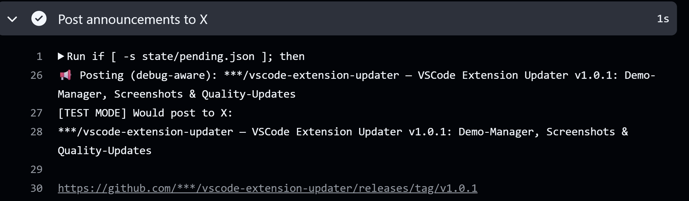

# 🚀 Release Announcer – GitHub → X (Twitter)

Automatisiertes Posten von GitHub-Releases auf **X (Twitter)** – wahlweise im **Debug-/Testmodus** oder direkt im **Produktivmodus**.

---

## 📸 Screenshot (Debug-Modus)

---

## 📖 Überblick

Dieses Projekt durchsucht automatisch ein angegebenes Repository nach neuen **Releases** und postet deren Ankündigung auf **X**.
Dank des integrierten **Debugmodus** kannst du gefahrlos testen, ohne dass reale Posts abgesetzt werden.

---

## ⚙️ Funktionsweise

1. **scan\_release.py** prüft GitHub-Releases des Ziel-Repositories
2. **post\_to\_x.py** sendet (oder simuliert bei Debug) den Post
3. **GitHub Actions Workflow** `announce-on-x.yml` steuert den Ablauf

---

## 🛠 Konfiguration

Siehe [USAGE\_GUIDE.md](./USAGE_GUIDE.md) für eine vollständige Anleitung zur Einrichtung
und zum Umschalten zwischen **Debug** (`DEBUG_MODE=true`) und **Produktivmodus** (`DEBUG_MODE=false`).

---

## 📜 Changelog

Alle Änderungen findest du in der [CHANGELOG.md](./CHANGELOG.md).

---

## 📄 Lizenz

Dieses Projekt steht unter der [MIT-Lizenz](./LICENSE.md).
Frei verwendbar – Änderungen und Pull Requests willkommen.

---

## ✍️ Autor

**© 2025 André Hohenstein – Microsoft Certified Trainer**
